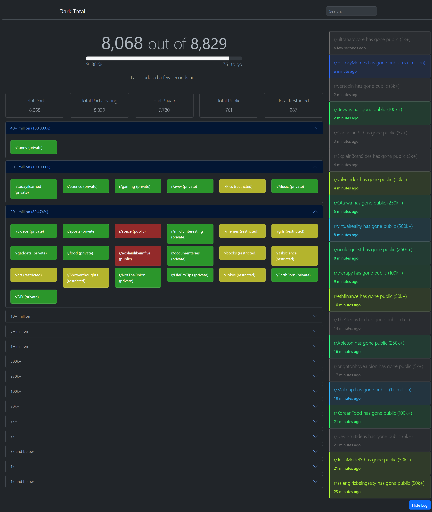

# DarkTotal.com

The code behind https://darktotal.com

Tracks the total number of Subreddits changing state in realtime.

Utilizes the SSE (Server-Sent Events) protocol to stream from https://github.com/reddark-remix/reddark-remix



## News / Sponsored Ad

Want to stay up-to-date on Reddit news without spending hours reading through articles? Check out the link below. Tl;dr daily news takes top news articles from around the world and condenses them into easy-to-read summaries. 

- https://tldrdaily.news/tag/reddit

## API

### https://darktotal.com/api/subreddits

Returns a JSON list of all Subreddits and their current state.
```json
{
    "status":200,
    "subreddits":[
        {
            "name":"r/example",
            "group":"1k+",
            "status":"private",
            "updatedAt":"2023-06-14T02:20:48.250Z"
        } ...
    ]
}
```

### Filtering Examples

- https://darktotal.com/api/subreddits?group=1k+
- https://darktotal.com/api/subreddits?group=1k+&status=private
- https://darktotal.com/api/subreddits?group=1k+&status=private&limit=5
- https://darktotal.com/api/subreddits?group=1k+&status=private&limit=5&page=2


## Developer Setup

Install [Meteor](https://www.meteor.com/)

```
git clone git@github.com:devnull9090/darktotal.com.git
cd darktotal.com
meteor npm install
meteor
```
